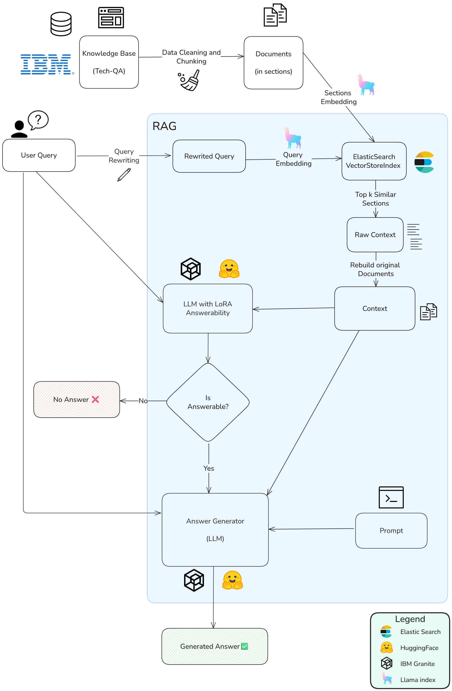
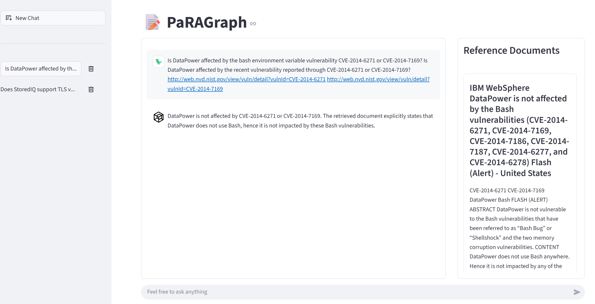

# PaRAGraph - A Technical Question Answering RAG System

PaRAGraph is a Retrieval-Augmented Generation (RAG) system designed to answer technical questions using IBM's Tech-QA dataset.
The system uses different models suited for embedding, query rewriting, answerability prediction, and answer generation.

## System Architecture

The RAG pipeline consists of the following components, each one is a notebook contained in the techqa_report folder:

1. **Data Preprocessing** - Document parsing and section extraction
2. **Vector Store Creation** - Embedding generation and indexing
3. **Query Rewriting** - Query optimization for better retrieval
4. **Document Retrieval** - Semantic search and document reconstruction
5. **Context Pruning** - Relevance-based context filtering
6. **Answerability Prediction** - Determining if a question can be answered
7. **Answer Generation** - LLM-based response generation
8. **Evaluation** - Performance evaluation using multiple metrics

## Web-App Components (DEMO)

### RAG Engine (`app/PaRAGraph.py`)
The main RAG system implementation consists of:
- **Query Rewriting**: Optimizes user questions
- **Document Retrieval**: Semantic search with score thresholding
- **Answer Generation**: Context-aware response generation

### Web Interface (`app/start_gui.py`)
Streamlit-based GUI providing:
- Interactive chat interface
- Real-time document visualization
- Conversation history management
- Reference document display with official links

### Conversation Management (`app/ConversationRepository.py`)
MongoDB-based system for chat history persistence

## Built With  

### Models
- [**ibm-granite/granite-embedding-30m-english**](https://huggingface.co/ibm-granite/granite-embedding-30m-english): used for creating and managing embeddings.
- [**catyung/t5l-turbo-hotpot-0331**](https://huggingface.co/catyung/t5l-turbo-hotpot-0331): used to rewrite queries for document retrieval from the Vector Store Index.
- [**naver/provence-reranker-debertav3-v1**](https://huggingface.co/naver/provence-reranker-debertav3-v1): used to perform context pruning.
- [**ibm-granite/granite-3.2-8b-instruct**](https://huggingface.co/ibm-granite/granite-3.2-8b-instruct): used for answer generation.
- [**ibm-granite/granite-3.2-8b-lora-rag-answerability-prediction**](https://huggingface.co/ibm-granite/granite-3.2-8b-lora-rag-answerability-prediction): LoRA adapter of the previous model, used to assess question answerability.
- [**ibm-granite/granite-3.2-2b-instruct**](https://huggingface.co/ibm-granite/granite-3.2-2b-instruct): a smaller model used for local answer generation.
- [**Qwen/Qwen3-1.7B**](https://huggingface.co/Qwen/Qwen3-1.7B): used for RAG system validation.

### Infrastructure
- **Vector Database**: Elasticsearch 9.0.3
- **Conversation Database**: MongoDB
- **GPU Support**: DirectML (for AMD GPUs) / CUDA
- **Framework**: LlamaIndex for RAG orchestration
- **UI**: Streamlit for web interface

### Key Libraries
- `transformers` - Hugging Face model integration
- `llama-index` - RAG framework
- `elasticsearch` - Vector search
- `vllm` - Efficient LLM inference
- `deepeval` - RAG evaluation metrics
- `streamlit` - Web interface

## Setup and Usage

1. **Prerequisites**: Install Elasticsearch and MongoDB
2. **Environment**: Set up Python environment with required packages (3.10 if using torch_directml)
3. **Launch Elasticsearch DB**: for storing the embeddings
4. **Data Preparation**: Run notebooks 1-2 to process data and create indices
5. **Launch MongoDB** 
6. **Application Launch**: Execute `streamlit run start_gui.py` to start the GUI